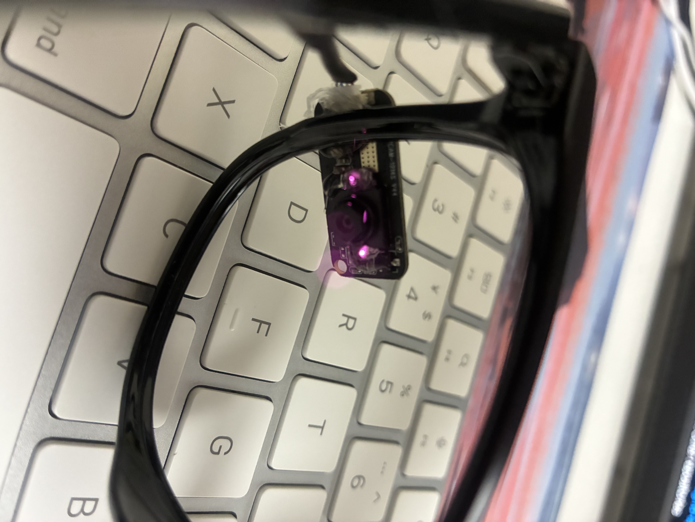
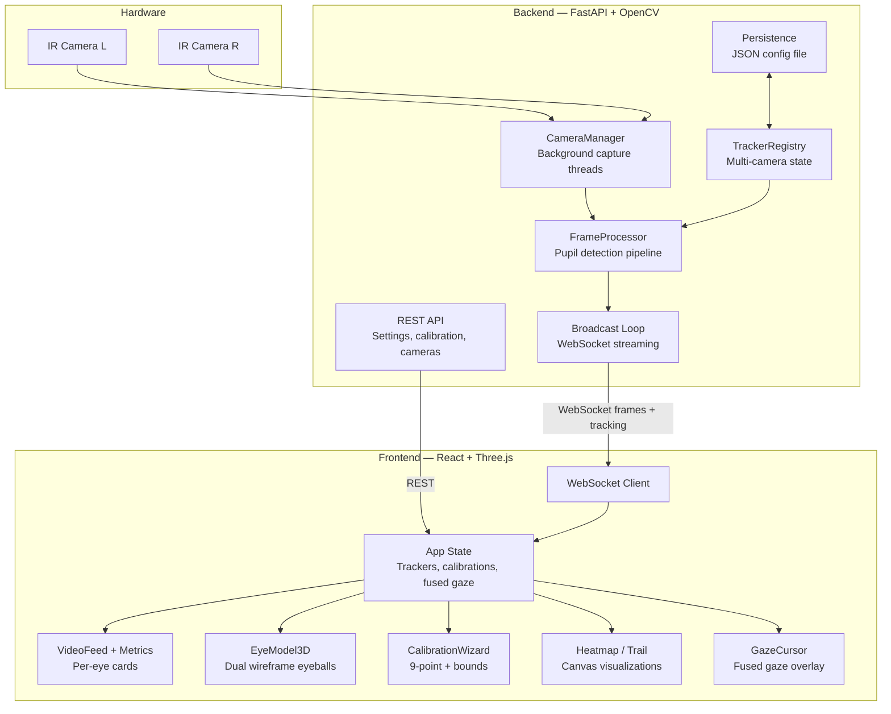

# 👁 EyeTrack

Real-time gaze tracking with affordable IR cameras. Runs in the browser, supports dual-eye stereo tracking, and works on macOS, Windows, and Linux.

Built on OpenCV pupil detection and polynomial gaze mapping, wrapped in a modern web UI with live video, 3D eye visualization, heatmaps, and gaze trails.

https://github.com/user-attachments/assets/8f7f9201-150e-4fcb-ba1e-9ae23bb7a660

---

## 🛒 Hardware

All you need to get started:

- **IR camera** — GC0308 USB infrared camera module (1 for single-eye, 2 for dual-eye)
- **IR LED** — optional, improves pupil contrast in low light
- **Glasses frame** — any frame to mount cameras near the eyes
- **Hot glue gun + glue sticks** — to secure cameras onto the frame
- **USB cable** — to connect cameras to your computer

That's it. No special boards, no soldering required.

<p>
  
  &nbsp;
  
</p>

---

## ✨ Features

- **Dual-eye tracking** — up to 2 IR cameras, each assigned to left/right eye
- **Three tracking modes** — Classic (Orlosky algorithm), Enhanced (EWMA), Screen (direct mapping)
- **9-point gaze calibration** — Vision Pro-inspired, with stability checking and audio feedback
- **Bounds calibration** — learns valid pupil range to filter blinks and outliers
- **Live dashboard** — annotated video feeds, real-time metrics, pupil size sparkline
- **3D eye model** — dual wireframe eyeballs with gaze direction, mirror/anatomical view toggle
- **Gaze cursor** — fused screen position from both eyes, weighted by confidence and calibration accuracy
- **Heatmap & trail** — fullscreen gaze visualizations with theme-aware rendering
- **Camera binding** — identifies cameras by hardware ID, survives reboots
- **Dark / light theme** — system-aware with manual toggle
- **Persistent config** — all settings, calibrations, and camera assignments saved to disk

---

## 🏗 Architecture



---

## 🚀 Quick Start

### Prerequisites

- Python 3.10+
- Node.js 18+ with pnpm
- USB IR camera (tested with GC0308)

### Backend

```bash
# Install dependencies
uv sync

# Start the server
uv run uvicorn web.app.main:app --host 0.0.0.0 --port 8100 --ws wsproto
```

### Frontend

```bash
cd web/frontend
pnpm install
pnpm dev          # Dev server at http://localhost:5173
```

For production, build the frontend and let FastAPI serve it:

```bash
cd web/frontend
pnpm build        # Output in dist/, auto-mounted by backend
```

Then visit `http://localhost:8100`.

---

## 📂 Project Structure

```
├── src/                        # Core algorithms
│   └── pupil_detector.py       # Cascaded thresholding + ellipse fitting
├── web/
│   ├── app/                    # FastAPI backend
│   │   ├── main.py             # App factory, startup/shutdown
│   │   ├── broadcast.py        # Frame capture → process → WebSocket push
│   │   ├── camera.py           # Camera detection, preview, hardware binding
│   │   ├── processor.py        # Pupil detection, eye center, 3D gaze
│   │   ├── state.py            # Tracker registry, settings, shared state
│   │   ├── persistence.py      # JSON config save/load
│   │   └── routers/            # REST + WebSocket endpoints
│   └── frontend/               # React SPA
│       └── src/
│           ├── components/     # VideoFeed, EyeModel3D, CalibrationWizard, etc.
│           ├── hooks/          # useWebSocket, useTrackingData, useTheme
│           ├── lib/            # Calibration math, audio feedback
│           └── types/          # TypeScript interfaces
├── docs/                       # Session logs and design docs
└── pyproject.toml              # Python project config
```

---

## 🔧 Tech Stack

| Layer | Tech |
|-------|------|
| Vision | OpenCV, NumPy |
| Backend | FastAPI, Uvicorn, wsproto |
| Frontend | React 19, TypeScript, Tailwind CSS v4 |
| 3D | Three.js, React Three Fiber |
| Animation | Framer Motion |
| Tooling | pnpm, Biome, Ruff, uv |

---

## 🎯 How It Works

1. **Capture** — Background threads grab frames from IR cameras at up to 120 fps
2. **Detect** — Cascaded thresholding finds the darkest region, fits an ellipse to the pupil
3. **Filter** — Confidence scoring, aspect ratio checks, and bounds calibration reject blinks and noise
4. **Track** — Eye center estimated via ellipse normal intersections (Classic or EWMA algorithm)
5. **Calibrate** — 9-point polynomial regression maps pupil position to screen coordinates
6. **Fuse** — Dual-eye gaze weighted by `confidence × (1 / calibration_error)`
7. **Stream** — Annotated frames + tracking data pushed over WebSocket at target FPS
8. **Render** — React renders live feeds, 3D model, metrics, heatmap, and gaze cursor

---

## 🖥 Supported Platforms

| Platform | Camera Backend | Status |
|----------|---------------|--------|
| macOS | AVFoundation | Fully tested |
| Windows | DirectShow | Supported |
| Linux | V4L2 | Supported |

Camera detection on macOS uses `system_profiler` to avoid triggering iPhone Continuity Camera.

---

## 📖 Documentation

Detailed session logs with design decisions, trade-offs, and implementation notes:

- [2026-04-05 — Web platform build, algorithm optimization, architecture redesign](docs/2026-04-05-session-log.md)
- [2026-04-08 — Dual-eye tracking, camera binding, performance, theme system](docs/2026-04-08-session-log.md)

---

## 🙏 Credits

Pupil detection algorithm adapted from [JEOresearch/EyeTracker](https://github.com/JEOresearch/EyeTracker) by Jason Orlosky.
