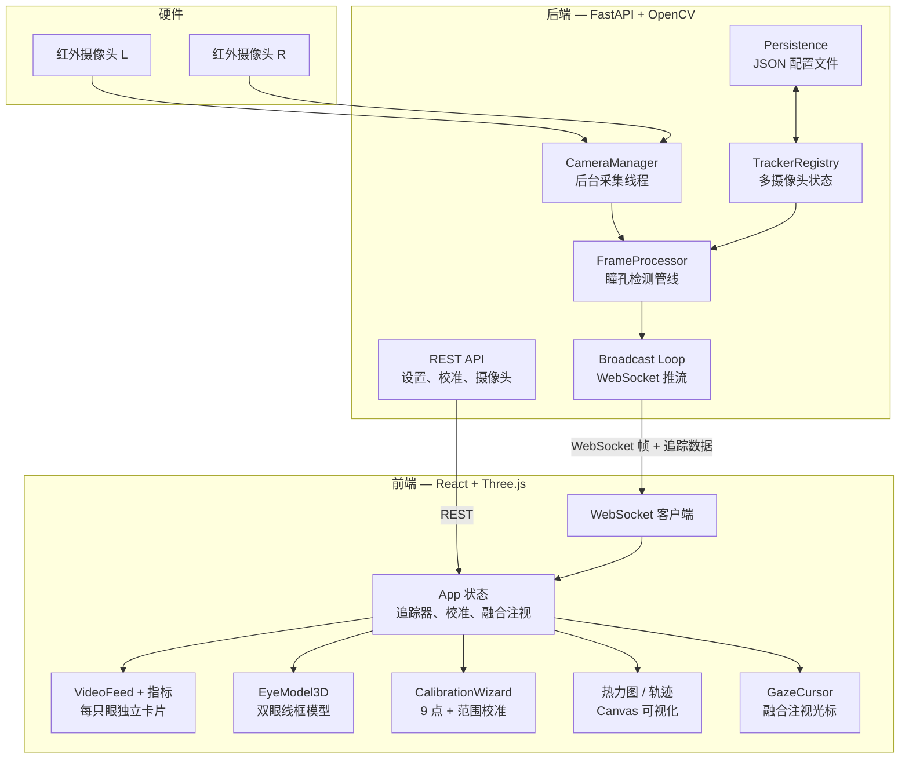

# 👁 EyeTrack — 开源眼动追踪

基于廉价红外摄像头的实时注视追踪系统，浏览器即开即用，支持双目立体追踪，兼容 macOS、Windows 和 Linux。

底层采用 OpenCV 瞳孔检测与多项式注视映射，上层是现代化 Web 界面——实时视频、3D 眼球模型、热力图、注视轨迹，一应俱全。

https://github.com/user-attachments/assets/8f7f9201-150e-4fcb-ba1e-9ae23bb7a660

---

## 🛒 硬件清单

上手只需要这些：

- **红外摄像头** — GC0308 USB 红外摄像头模组（单眼 1 个，双眼 2 个）
- **红外补光灯** — 可选，弱光环境下能增强瞳孔对比度
- **眼镜框** — 任意镜框，用来固定摄像头
- **热熔胶枪 + 胶棒** — 把摄像头粘在眼镜框上
- **USB 线** — 连接摄像头和电脑

就这些，不需要额外的开发板，不需要焊接。

<p>
  
  &nbsp;
  
</p>

---

## ✨ 功能亮点

- **双目追踪** — 最多接入 2 个红外摄像头，分别指定左/右眼
- **三种追踪模式** — Classic（Orlosky 算法）、Enhanced（EWMA）、Screen（直接映射）
- **9 点注视校准** — 参考 Vision Pro 的交互设计，带稳定性检测和音频反馈
- **范围校准** — 自动学习有效瞳孔区域，过滤眨眼和异常值
- **实时面板** — 标注后的视频画面、实时指标、瞳孔大小变化图
- **3D 眼球模型** — 双眼线框模型，实时跟随注视方向，支持镜像/解剖视角切换
- **注视光标** — 融合双眼数据的屏幕注视点，按置信度和校准精度加权
- **热力图与轨迹** — 全屏注视可视化，自适应明暗主题
- **摄像头绑定** — 通过硬件 ID 识别摄像头，重启不丢失
- **明暗主题** — 跟随系统偏好，支持手动切换
- **配置持久化** — 设置、校准数据、摄像头分配全部保存到本地

---

## 🏗 系统架构



---

## 🚀 快速开始

### 环境要求

- Python 3.10+
- Node.js 18+，并安装 pnpm
- USB 红外摄像头（已测试 GC0308）

### 后端

```bash
# 安装依赖
uv sync

# 启动服务
uv run uvicorn web.app.main:app --host 0.0.0.0 --port 8100 --ws wsproto
```

### 前端

```bash
cd web/frontend
pnpm install
pnpm dev          # 开发服务器 http://localhost:5173
```

生产部署时，构建前端静态文件，由 FastAPI 直接托管：

```bash
cd web/frontend
pnpm build        # 输出到 dist/，后端自动挂载
```

然后访问 `http://localhost:8100`。

---

## 📂 项目结构

```
├── src/                        # 核心算法
│   └── pupil_detector.py       # 级联阈值 + 椭圆拟合
├── web/
│   ├── app/                    # FastAPI 后端
│   │   ├── main.py             # 应用工厂，启动/关闭
│   │   ├── broadcast.py        # 采集 → 处理 → WebSocket 推送
│   │   ├── camera.py           # 摄像头检测、预览、硬件绑定
│   │   ├── processor.py        # 瞳孔检测、眼球中心、3D 注视
│   │   ├── state.py            # 追踪器注册、设置、共享状态
│   │   ├── persistence.py      # JSON 配置读写
│   │   └── routers/            # REST + WebSocket 端点
│   └── frontend/               # React 单页应用
│       └── src/
│           ├── components/     # VideoFeed、EyeModel3D、CalibrationWizard 等
│           ├── hooks/          # useWebSocket、useTrackingData、useTheme
│           ├── lib/            # 校准数学、音频反馈
│           └── types/          # TypeScript 类型定义
├── docs/                       # 开发日志与设计文档
└── pyproject.toml              # Python 项目配置
```

---

## 🔧 技术栈

| 层级 | 技术 |
|------|------|
| 视觉算法 | OpenCV、NumPy |
| 后端服务 | FastAPI、Uvicorn、wsproto |
| 前端界面 | React 19、TypeScript、Tailwind CSS v4 |
| 3D 渲染 | Three.js、React Three Fiber |
| 动效 | Framer Motion |
| 工具链 | pnpm、Biome、Ruff、uv |

---

## 🎯 工作原理

1. **采集** — 后台线程从红外摄像头抓取帧，最高 120 fps
2. **检测** — 级联阈值定位最暗区域，椭圆拟合提取瞳孔轮廓
3. **过滤** — 置信度评分、长宽比检查、范围校准联合过滤眨眼和噪声
4. **追踪** — 通过椭圆法线交点估算眼球中心（Classic 或 EWMA 算法）
5. **校准** — 9 点多项式回归，建立瞳孔位置到屏幕坐标的映射
6. **融合** — 双眼注视按 `置信度 × (1 / 校准误差)` 加权融合
7. **推流** — 标注帧 + 追踪数据通过 WebSocket 按目标帧率推送
8. **渲染** — React 实时渲染视频、3D 模型、指标面板、热力图和注视光标

---

## 🖥 平台支持

| 平台 | 摄像头后端 | 状态 |
|------|-----------|------|
| macOS | AVFoundation | 完整测试 |
| Windows | DirectShow | 已支持 |
| Linux | V4L2 | 已支持 |

macOS 上使用 `system_profiler` 检测摄像头，避免触发 iPhone 连续互通相机。

---

## 📖 开发文档

详细的开发日志，记录了设计决策、权衡取舍和实现细节：

- [2026-04-05 — Web 平台搭建、算法优化、架构重设计](docs/2026-04-05-session-log.md)
- [2026-04-08 — 双目追踪、摄像头绑定、性能优化、主题系统](docs/2026-04-08-session-log.md)

---

## 🙏 致谢

瞳孔检测算法改编自 [JEOresearch/EyeTracker](https://github.com/JEOresearch/EyeTracker)（原作者 Jason Orlosky）。
